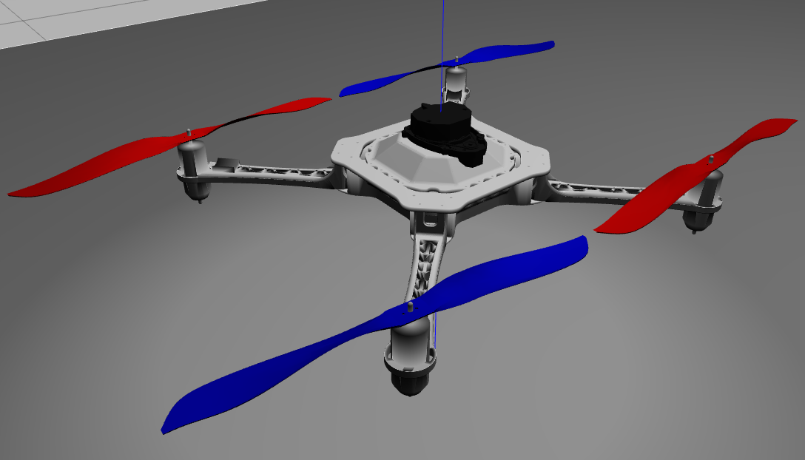

<h1 align="center">Hybrid Unmanned Aerial Underwater Vehicle</h1>
<h3 align="center">Deep Reinforcement Learning applied to hybrid vehicles using gazebo with RotorS and UUV sim as a simulated training environment.</h3>

<p align="center"> 
  
  
  
</p>
<br/>

## Summary
<p align="justify"> 
  
  <a> We propose the use of Deep-RL to perform autonomous mapless navigation for HUAUVs. We developed two approaches based on state-of-the-art
  Deep-RL algorithms: (i) Deep Deterministic Policy Gradient (DDPG) and (ii) Soft Actor-Critic (SAC). Our system uses the vehicle's relative localization
  data and simple sparse range data to train the intelligent agents. We compared our approaches with a traditional geometric tracking controller
  for mapless navigation.</a>  
</p>
  
## Setup
<p align="justify"> 
 <a>All of requirements is show in the badgets above, but if you want to install all of them, enter the repository and execute the following line of code:</a>
</p>

```shell
pip3 install -r requirements.txt
```

<p align="justify"> 
 <a>Before cloning the repository we need to configure your workspace. To do this proceed with the following commands in your terminal:</a>
</p>

```shell
mkdir -p ~/hydrone/src
```
```shell
cd ~/hydrone/
```
```shell
catkin_make
```

<p align="justify"> 
 <a>Now that the workspace is already configured just enter the src folder and clone the repository, finally compile the project. To do this proceed with the following commands in your terminal:</a>
</p>

```shell
cd ~/hydrone/src/
```

```shell
git clone https://github.com/ricardoGrando/hydrone_deep_rl_icra --recursive
```

```shell
cd ~/hydrone/
```

```shell
catkin_make
```

<p align="justify"> 
 <a>We now need to configure your terminal to accept the commands directed to our hydrone workspace. For this you can simply copy the line of code below to your .bashrc (or .zshrc if you use zsh instead of bash) or put the code directly into your terminal. Note that if you choose the second option, every time you open a new terminal you will have to give the following command again.</a>
</p>

<p align="justify"> 
 <a>For <b>bash</b>:</a>
</p>

```shell
source ~/hydrone/devel/setup.bash
```

<p align="justify"> 
 <a>For <b>zsh</b>:</a>
</p>

```shell
source ~/hydrone/devel/setup.zsh
```

<p align="justify"> 
 <a>Okay, now your Hydrone is ready to run!</a><br/>
 <a>To do this, just execute the following command:</a>
</p>

```shell
roslaunch hydrone_deep_rl_icra hydrone.launch
```

## Structure
<p align="justify"> 
  <a>The way Jubileo works may seem a bit complex and in fact some parts are. We recommend to you visualize yourself how the Hydrone's nodes works
  (with the Hydrone already running) by using the following command:</a>
</p>

```shell
rosrun rqt_graph rqt_graph
```

## Media

<p align="center"> 
  
  
</p>  

<p align="justify"> 
  <a>We have the official simulation video posted on youtube, to access it just click on the following hyperlink:</a><a href="https://www.youtube.com/"> Hydrone Video</a>
</p>

<p align="center"> 
  <a><i>If you liked this repository, please don't forget to starred it!</i></a>
  
</p>

